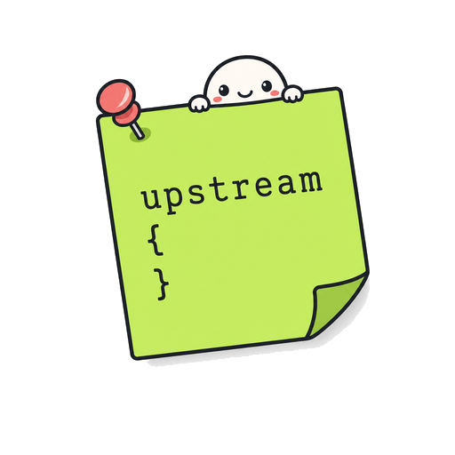

<p align="center">
  
</p>

<h1 align="center">NGINX Plus Quick Reference</h1>

<p align="center"><sub>NGINX® and NGINX Plus® are registered trademarks of F5, Inc. This is an unofficial community reference and is not affiliated with, endorsed by, or sponsored by F5.</sub></p>

> A field-ready, use-case-driven guide to what NGINX Plus unlocks beyond open-source NGINX.
> Built for F5 Solutions Engineers in the field, NGINX Plus customers evaluating the platform, and anyone deciding between Plus and OSS.

**🌐 Live site:** https://geevibe.github.io/nginx-plus-quick-reference/


---

## Who this is for

| Audience | What you get |
|---|---|
| **F5 Field SEs** | A whiteboard-on-demand tool for prospect calls. Click a use case → marketecture diagram + Plus-only directives + customer-value framing + copy-paste config. |
| **F5 Customers & Prospects** | A clear, plain-English view of what NGINX Plus delivers beyond the open-source build, organized by what you're actually trying to *do* — not by directive name. |
| **Partners & Community** | A licensed reference you can fork and customize for your vertical, region, or training material. |

---

## What's inside

- Information cards and diagrams for **36 directives** across **17 use-case categories** — authentication, load balancing, API gateway, HA & clustering, key-value store, health checks, TLS, caching, session logging, and more
- **Inline marketecture diagrams** — fullscreen-ready, presentable, designed to *replace* the whiteboard
- **Copy-paste config snippets** — every directive comes with a working example
- **Customer-value framing** — every entry answers *what does Plus unlock that OSS can't?*
- **Keyboard-first navigation** — `/` to search, `F` for fullscreen, arrow keys to flip diagrams

---

## How it stays current

This guide auto-updates itself.

A [Claude Code skill](skills/nginx-plus-guide-updater/) watches the official NGINX Plus release notes. When a new Plus-only directive is introduced, the skill:

1. Detects the change in the release notes
2. Reads the official documentation page for the new directive (docs.nginx.com is the source of truth)
3. Generates a new directive card in the guide's format
4. Suggests which use-case category it belongs to
5. Opens a pull request with a diff, sources, and a review checklist

A human (currently me) reviews the PR and merges it. The site rebuilds automatically.

📖 **Full architecture:** [`docs-meta/HOW-THE-AUTO-UPDATE-WORKS.md`](docs-meta/HOW-THE-AUTO-UPDATE-WORKS.md)

---

## Local development

The site is pure static HTML/CSS/JS. No build step, no framework, no server.

```bash
# Clone
git clone https://github.com/GeeVibe/nginx-plus-quick-reference.git
cd nginx-plus-quick-reference

# Open in your browser
open docs/index.html
# or serve locally on port 8000
python3 -m http.server 8000 -d docs
```

Edit `docs/app.js` to add or modify directive entries. The site reloads on refresh — no build pipeline.

---

## Repository structure

```
nginx-plus-quick-reference/
├── docs/                          # The GitHub Pages site (HTML/CSS/JS)
│   ├── index.html
│   ├── app.js                     # All directive content lives here
│   └── style.css
├── skills/
│   └── nginx-plus-guide-updater/  # Claude Code skill for auto-updates
│       ├── SKILL.md
│       └── scripts/
├── .github/
│   └── workflows/
│       └── auto-update.yml        # Weekly cron + manual trigger
├── docs-meta/                     # Documentation about the project itself
│   ├── FOR-FIELD-SES.md
│   ├── FOR-CUSTOMERS.md
│   ├── HOW-THE-AUTO-UPDATE-WORKS.md
│   └── EXTENDING-THE-GUIDE.md
├── CONTRIBUTING.md
├── CHANGELOG.md
├── LICENSE                        # CC BY-NC-SA 4.0
└── README.md
```

---

## Licensing & use

Released under **[Creative Commons BY-NC-SA 4.0](LICENSE)** — meaning:

✅ **You can:** Fork it. Customize it. Use it with customers. Share it. Translate it.
✅ **F5 teams, partners, customers, and the broader NGINX community** are explicitly welcome.
❌ **You cannot:** Repackage it commercially or pass it off as your own product.

The intent: keep this as a useful asset for the NGINX ecosystem while preventing competitors from lifting it wholesale.

---

## Contact

Created by **Gee Chow** (F5).
Questions, suggestions, PRs welcome. See [`CONTRIBUTING.md`](CONTRIBUTING.md).

Reach out: contact info in [`docs-meta/CONTACT.md`](docs-meta/CONTACT.md).

---

*This project is community-built and is not an official F5 product. The official NGINX Plus product documentation lives at [docs.nginx.com](https://docs.nginx.com).*
